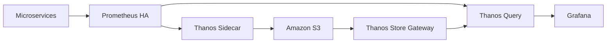

# Production-Grade Kubernetes Monitoring Platform

This repository provides a production-ready monitoring stack for Kubernetes microservices using Prometheus, Thanos, Grafana, Alertmanager, and Amazon S3-backed object storage. It is designed to work on AWS EKS or a local Kind cluster with minimal changes.

## Architecture



## Included Components

- Prometheus HA with two replicas
- Thanos Sidecar, Query, Store Gateway, Compactor, and Bucket Web
- Grafana with dashboards and datasource configuration
- Alertmanager
- Node Exporter, kube-state-metrics, and cAdvisor
- Sample Go microservice exposing metrics
- Terraform for S3 bucket and IAM resources
- Helm chart values and deployment scripts

## Repository Layout

- kubernetes/ - Kubernetes manifests grouped by component
- helm/ - Helm chart and values
- terraform/ - Infrastructure as code for S3 and IAM
- scripts/ - Install, verify, rollback, and cleanup scripts
- docs/ - Detailed deployment, architecture, and troubleshooting guides
- docker-compose/ - Local development stack
- sample-app/ - Go microservice example

## Deployment Order

1. Create namespace and storage resources
2. Deploy Prometheus and Alertmanager
3. Deploy Thanos components
4. Deploy Grafana
5. Deploy exporters
6. Deploy sample application
7. Verify dashboards and metric flows

## Quick Start

```bash
kubectl apply -f kubernetes/namespace.yaml
kubectl apply -f kubernetes/storage/
kubectl apply -f kubernetes/prometheus/
kubectl apply -f kubernetes/thanos/
kubectl apply -f kubernetes/exporters/
kubectl apply -f kubernetes/grafana/
kubectl apply -f kubernetes/microservices/
```

## Notes

- Update the S3 credentials and bucket values before deploying to production.
- Review the files in kubernetes/storage/ and docs/s3-configuration.md for IAM and bucket policy guidance.
- Replace placeholder hostnames and secrets with environment-specific values.
